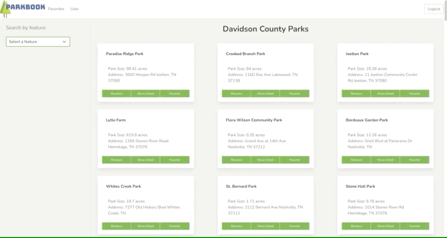
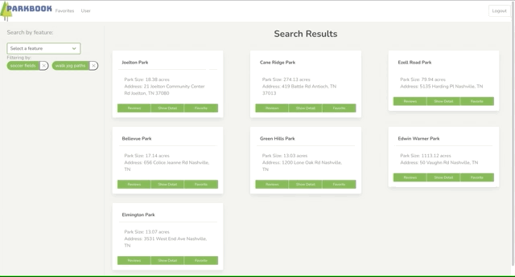
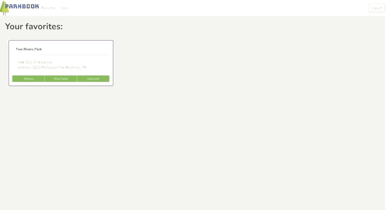
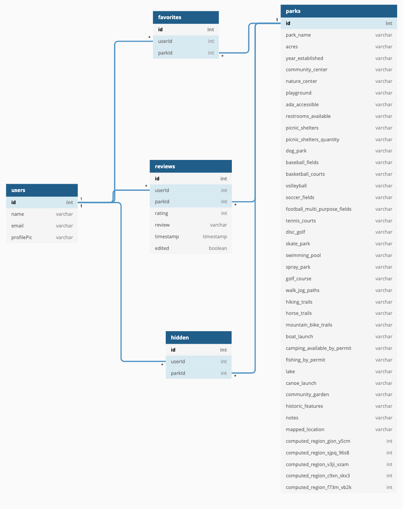

# Parkbook

>Search parks in Nashville, Tennessee for specific features, save parks you like, and leave reviews on parks.  
  
## Motivation

This app was built to provide a simple and intuitive way to discover what nearby parks have to offer. During the pandemic I found mself spending more time outside to socially distance with friends. I was a aware of many of the parks in Nashville, but did not know of a simple way to search through every park all at once. In March 2021 I needed a front-end capstone project for a coding bootcamp. I searched for inspiration and found a dataset of Nashville's parks, which lead me to the idea for this app.
  
## Installation
Make a copy of database.json.example  
Run a [json-server](https://www.npmjs.com/package/json-server)  from the api directory
``` 
npm install
npm start
```


## Screenshots

### Filter Parks by Feature

### Expand Park Detail

### Leave Reviews


## Tech 
React, Javascript, CSS, [Bulma](https://bulma.io/), and a touch of [SASS](https://sass-lang.com/)

This project was bootstrapped with [Create React App](https://github.com/facebook/create-react-app).

## ERD


The foundation of this app is a dataset of Nashville's parks. This data is in the public doman and was duplicated from [Data.Nashville.gov](https://data.nashville.gov/Parks/Park-Locations/74d7-b74t)

## A Note About Authentication

The login and registration code used is fake, completely insecure, and would never be implemented in a professional application. It is a simulation authentication using very simplistic tools, because authentication is not a learning objective of this project.